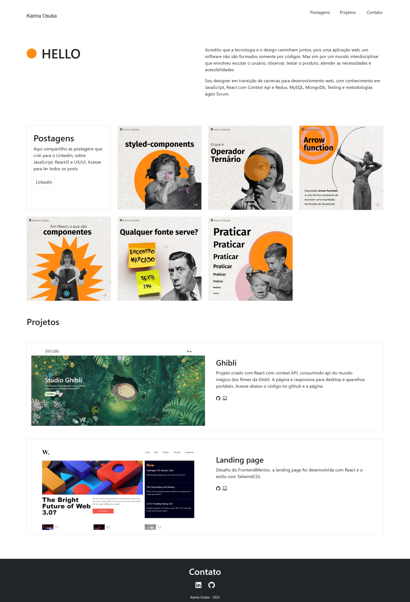

<h1>Portfolio</h1>

Projeto criado com ReactJS

 

   

## Tecnologias

Esse projeto foi desenvolvido com as seguintes tecnologias:

- ReactJS
- HTML e CSS
- TailwindCss
- Axios

## Projeto

Com intuito de estudar ReactJs, criei a página responsiva para mostrar meus projetos e conteúdos criados no Linkedin.

## Github pages

Visite a página [Link](https://kari-osk.github.io/projetos/)

